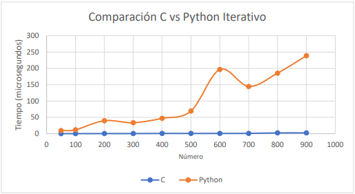
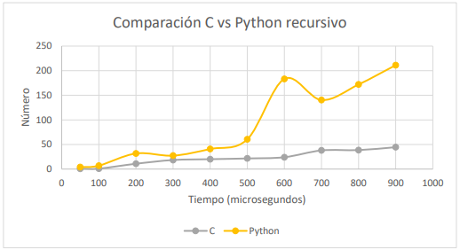
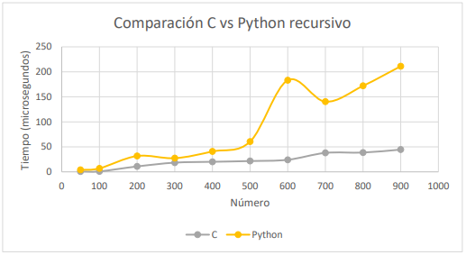

# CvsPython
Pruebas de velocidad para calcular factoriales en C y Python de forma iterativa y recursiva

# Resultados obtenidos

Tabla de resultados de los tiempos, en microsegundos, obtenidos al ejecutar factoriales del 50 al 900 en Python y C de manera iterativa y recursiva.

| NÚMERO | ITERATIVO (C) | RECURSIVO (C) | ITERATIVO (PYTHON) | RECURSIVO (PYTHON) |
|--------|---------------|---------------|--------------------|--------------------|
| 50     | 0,2           | 0,7           | 9,500014           | 3,900001           |
| 100    | 0,3           | 0,9           | 12,000004          | 6,899994           |
| 200    | 0,4           | 10,8          | 39,799983          | 31,699979          |
| 300    | 0,5           | 18,4          | 33,599994          | 27,300004          |
| 400    | 0,9           | 20,1          | 47,000009          | 40,799991          |
| 500    | 0,8           | 21,6          | 69,400005          | 60,399994          |
| 600    | 0,9           | 24,1          | 196,700013         | 183,299999         |
| 700    | 1,0           | 37,9          | 144,599995         | 140,299991         |
| 800    | 2,4           | 38,6          | 185,399986         | 172,000000         |
| 900    | 2,5           | 44,5          | 238,699984         | 211,199978         |

 

Gráficos obtenidos a partir de los resultados
-------

**Gráfico 1. Comparación general de todos los tiempos obtenidos entre C y Python.**

-------

**Gráfico 2. Comparación de tiempos entre C y Python al ejecutar factoriales de forma iterativa.**

---------

**Gráfico 3. Comparación de tiempos entre C y Python al ejecutar factoriales de forma recursiva.**

 

## Miembros del grupo

- Laura González
- Camilo Madero
- Paula Páez
- Felipe Rodriguez